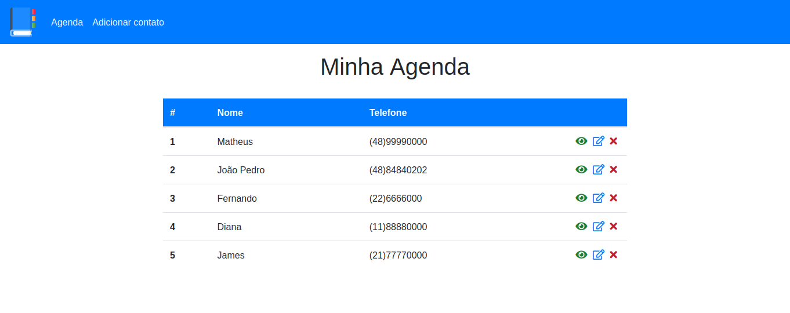

<h1 align="center">agenda-hdc</h1>

<h1 align="center">
    
</h1>

<h4 align="center"> 
	🚧  agenda-hdc 🚀 concluído  🚧
</h4>

## Sobre o projeto

Projeto desenvolvido no curso de PHP do Hora de Codar

### 🛠 Tecnologias

Este projeto foi feito com as seguintes tecnologias:
- HTML
- CSS
- PHP

### Banco de Dados 

~~~Mysql

-- Banco de dados: `agenda`

-- Estrutura da tabela `contacts`

CREATE TABLE `contacts` (
  `id` int(11) NOT NULL,
  `name` varchar(250) DEFAULT NULL,
  `phone` varchar(20) DEFAULT NULL,
  `observations` text DEFAULT NULL
) ENGINE=InnoDB DEFAULT CHARSET=utf8mb4;

~~~

### IDE

- [Visual Studio Code](https://code.visualstudio.com/)

## 🦸 Autor
<h4 align="center">
  Feito por Sérgio Sobrinho <a href="https://www.linkedin.com/in/sobrinhosergio">Entre em contato!</a>
</h4>
